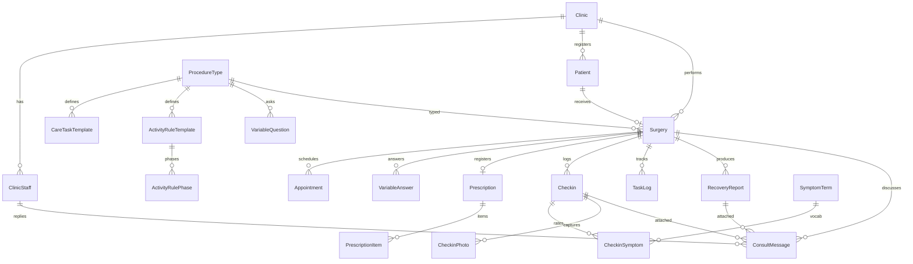

# 나란히 — ERD 설계서 (해설판)

기준 문서 · `나란히_기능명세서_v3.pdf` · `수술 후 주의사항 안내문.pdf` · `naranhi_prototype3.html`
구현 · `bbang-skin-recovery` (Django 6.0 · DRF · SimpleJWT · MySQL · S3)
동기화 · `8-10백엔드현황.md` 기준. **테이블 20개 정의 + 마이그레이션 완료 상태와 일치합니다.**

> 프로토타입을 만들지 않은 사람도 읽을 수 있게 썼습니다. 0장(서비스 이해)과 1장(용어집)을 먼저 읽으면 나머지가 훨씬 빨리 들어옵니다.
>
> **이 문서는 "왜 이렇게 설계했나"를 담습니다.** 엔드포인트 계약은 `8-10백엔드현황.md` 9장이 정본입니다.

### ⚠️ 아직 코드에 반영 안 된 것 3개

마이그레이션 한 번에 처리하세요. 지금이 제일 쌉니다.

```python
ConsultMessage.attached_checkin   = FK("checkins.Checkin", null=True, blank=True)
Surgery.consult_last_read_at      = DateTimeField(null=True, blank=True)
Prescription.source_image         = ImageField(..., blank=True)   # 확정 후 삭제하므로
```

첫째는 명세서 3.10의 첨부 3종, 둘째는 `GET /notifications`의 미읽음 판정, 셋째는 A-1의 "처방전 원본 삭제"에 필요합니다.

---

## 0. 이 서비스가 뭘 하는가

한국에서 코성형을 받은 일본인 환자가 **D+14쯤 귀국합니다.** 그런데 회복은 D+120까지 갑니다.

병원이 환자를 직접 보는 날은 **D+5(부목 제거)와 D+7(실밥 제거) 딱 이틀**입니다. 나머지 118일은 환자가 혼자 판단합니다. 세수해도 되나, 이 딱딱한 느낌이 정상인가, 비행기 타도 되나, 온천 가도 되나.

나란히는 그 118일을 채우는 앱입니다. 병원이 종이로 준 안내문을 D+N 단위로 쪼개서 매일 보여주고, 환자가 남긴 기록을 귀국 후 현지 의료진에게 보여줄 문서로 바꿔줍니다.

### 등장인물 3명

| | 하는 일 | DB에서 |
|---|---|---|
| **환자** | 앱을 씀. 매일 루틴 체크하고 사진·증상 기록 | `Patient` — 쓰기 권한이 있는 곳이 제한적 |
| **병원** | 시술 정보와 안내문을 등록. 상담 답변 | `Clinic` `ClinicStaff` — 환자가 못 고치는 값의 소유자 |
| **나란히** | 시술별 표준 프로토콜을 보유하고 관리 | `ProcedureType` + 템플릿 4종 — 운영자만 접근 |

### 데이터가 오는 곳이 세 갈래다 — 이게 이 ERD의 핵심 구조

이걸 이해하면 테이블 배치가 왜 이렇게 됐는지 다 설명됩니다.

```
① 나란히 마스터        시술별 표준 프로토콜 (루틴 · 규칙)
   └ 운영자가 미리 만들어 둠. 환자·병원 모두 수정 불가.

② 병원 파이프라인      환자 등록 · 시술 정보 · 수술기록 · 안내문 · 예약
   └ 병원이 등록. 환자는 읽기만. 틀리면 병원에 전화해야 함.

③ 환자 입력            처방전 사진 · 개인 변수 답변 · 귀국일 · 체크인 · 상담 문의
   └ 환자만 쓸 수 있음.
```

**왜 처방전만 환자가 찍는가?** 처방전은 법적으로 약국 제출용이라 병원에서 앱으로 넘어오지 않습니다. 그래서 이것만 환자가 직접 촬영하고 OCR로 읽습니다. 프로토타입에 이 사정이 화면 문구로 그대로 들어가 있습니다.

**왜 이 구분이 중요한가?** 온보딩 화면에서 `ⓘ 시술 정보는 병원이 등록한 값이라 환자가 고칠 수 없습니다`라고 명시합니다. 이건 UI 문구가 아니라 권한 설계입니다. 환자 토큰으로 `Surgery`에 쓰기가 되면 안 됩니다. 수술 종류가 바뀌면 D+120 루틴 전체가 바뀌기 때문입니다.

---

## 1. 용어집

읽다가 막히면 여기로 돌아오세요.

### D+N

수술일을 `D+0`으로 놓은 상대 일자입니다. **이 서비스의 모든 데이터는 D+N에 붙습니다.** 달력 날짜가 아니라 D+N이 1차 키 역할을 합니다.

- 수술일 2026-08-03 → `D+0`
- 2026-08-05 → `D+2`
- 귀국 2026-08-17 → `D+14`

`surgery_date`만 있으면 계산할 수 있지만, 거의 모든 쿼리가 D+N 기준이라 컬럼으로도 저장합니다(2장 D4 참조).

### 프로토콜 (Protocol)

병원이 종이로 주는 `수술 후 주의사항 안내문`을 DB로 구조화한 것입니다. 폴더의 `수술 후 주의사항 안내문.pdf`가 원본입니다.

한 덩어리가 아니라 **성격이 다른 두 종류**로 쪼개집니다. 이 둘을 헷갈리면 안 됩니다.

| | 뭔가 | 예 | 환자가 체크하나 | 이행률에 들어가나 |
|---|---|---|---|---|
| **루틴** (Task) | 환자가 **능동적으로 해야** 하는 반복 행동 | 절개부 소독 하루 2회, 냉찜질 하루 4회 | **한다** (칩 탭) | **들어간다** |
| **규칙** (Rule) | 하면 안 되거나 조건부인 행동 | 세안 금지, 비행 주의, 음주 금지 | 안 한다 (조회만) | 안 들어간다 |

루틴은 "하세요", 규칙은 "하지 마세요"입니다.

프로토타입에는 세 번째로 **마일스톤**(`MILE` 배열)이 있었습니다. `D+5 부목 제거`, `D+14 색조화장 가능` 같은 시점 이벤트 목록입니다. **이건 테이블로 만들지 않습니다.** 규칙 구간 경계와 예약에서 파생합니다(1장 마지막 절 참조).

### 루틴 (Care Task) — 7종

프로토타입 `ROUTINE` 배열입니다. 각각 `언제부터~언제까지, 하루 몇 번`을 갖습니다.

| 키 | 이름 | 기간 | 하루 |
|---|---|---|---|
| `antisep` | 절개부 소독 | D+1~7 | 2회 |
| `ice` | 냉찜질 | D+0~3 | 4회 |
| `warm` | 온찜질 | D+4~10 | 2회 |
| `sleep45` | 상체 45° 수면 | D+0~28 | 1회 |
| `walk` | 짧은 보행 | D+1~120 | 3회 |
| `saline` | 코 안 생리식염수 | D+3~21 | 3회 |
| `tape` | 압박 테이핑 교체 | D+8~28 | 1회 |

냉찜질이 D+3에 끝나고 온찜질이 D+4에 시작하는 게 보이시죠. 이게 안내문의 `수술 후 3일까지는 냉찜질을 하고, 4일 이후 미지근한 온찜질`을 그대로 옮긴 것입니다.

여기에 **복약**이 8번째 루틴으로 추가됩니다. 다만 출처가 프로토콜이 아니라 환자가 찍은 처방전이라 별도 취급합니다.

### 규칙 (Activity Rule) — 10종 · 구간 24개

프로토타입 `RULES` 배열입니다. 루틴과 결정적으로 다른 점은 **상태가 시간에 따라 바뀐다**는 것입니다.

`장거리 비행`을 예로 보면,

```
D+0  ~ D+10  →  금지   "기압 변화로 출혈 위험 — 금지"
D+11 ~ D+21  →  주의   "귀국일(D+14)이 이 구간 · 기내 수분과 보행 필수"
D+22 ~ D+120 →  가능   "제한 없음"
```

이 세 줄을 **구간(phase)** 이라고 부릅니다. 규칙 하나가 구간 2~3개를 갖고, 10개 규칙이 합쳐서 구간 24개입니다.

상태는 `no`(금지) / `care`(주의) / `ok`(가능) 3가지입니다. 홈 화면이 이 셋으로 나눠서 목록을 그립니다.

10종 목록: `wash`(세안) `flight`(장거리 비행) `glasses`(안경) `blow`(코 풀기) `ex`(운동) `drink`(음주·흡연) `sauna`(사우나·온천) `makeup`(색조화장) `side`(옆으로 눕기) `mass`(코 마사지·코팩)

### 해금 (Unlock)

규칙이 `금지`에서 `가능`으로 바뀌는 시점입니다. 홈 화면에 `다시 할 수 있게 된 것 3/10`으로 표시되고, `다음 해금 D+8 세안`처럼 예고됩니다.

이게 이 앱의 감정적 핵입니다. 회복은 지루한데, 하나씩 되돌아온다는 느낌이 완주를 만듭니다.

### 타임라인 (Timeline) — 저장하지 않고 파생한다

`전체 일정` 화면의 `앞으로의 변화` 목록입니다. `D+5 부목 제거 [내원]`, `D+8 세안 가능 [해금]` 같은 행이 날짜순으로 늘어섭니다.

프로토타입은 이걸 `MILE`이라는 손으로 쓴 배열 12건으로 갖고 있었습니다. **테이블로 만들지 않고 파생합니다.** 출처가 이미 다 있습니다.

| 이벤트 종류 | 어디서 | 어떻게 |
|---|---|---|
| `unlock` 해금 | `ActivityRulePhase` | 상태가 `no`/`care` → `ok`로 바뀌는 경계 |
| `care` 주의 시작 | `ActivityRulePhase` | 상태가 `no` → `care`로 바뀌는 경계 |
| `visit` 내원 | `Appointment` | 예약 그대로 |
| `return` 귀국 | `Surgery.return_day` | 환자 입력값 |
| `end` 완주 | `ProcedureType.program_days` | `D+120` |

**파생 방법.** 상태에 순위를 매기고(`no` 0 < `care` 1 < `ok` 2) 규칙별로 구간을 순서대로 훑어서, 다음 구간의 순위가 더 높으면 그 경계가 이벤트입니다.

```
flight [{to:10, no}, {to:21, care}, {to:120, ok}]
  → D+11  no → care    "장거리 비행 주의"
  → D+22  care → ok    "장거리 비행 가능"
```

같은 날 여러 규칙이 풀리면 한 줄로 묶습니다. `코 풀기 · 음주·흡연 · 옆으로 눕기 가능`

문구는 `{규칙 이름} + 가능/주의`로 만들고, 목표 구간의 `text`를 부제로 붙입니다. 손으로 쓴 마일스톤보다 정보가 오히려 많아집니다. `안경 착용 가능` 아래에 `D+60 이후 일반 착용 권장`이 같이 붙으니까요.

**왜 파생인가.** 이유가 셋입니다.

1. **번역 비용.** 마일스톤 12건 × 3개 언어 = 36개 문장을 새로 번역해야 합니다. 파생하면 규칙 이름 10개(이미 번역됨) + 동사 2개면 끝입니다
2. **불일치 방지.** 프로토타입의 `MILE`은 손으로 요약한 목록이라 규칙 구간과 경계가 어긋나 있었습니다. `D+21 비행 제한 해제`라고 적혀 있는데 `flight` 구간은 `{to:21, care}`여서 실제로는 D+22부터 가능입니다. 같은 데이터를 읽으면 이런 일이 구조적으로 불가능해집니다
3. **중복 제거.** `visit` 3건은 `Appointment`에 이미 있었습니다

**홈 화면의 `다음 해금`도 같은 함수입니다.** 타임라인에서 `day > 오늘`인 첫 이벤트만 뽑으면 됩니다. 프로토타입 `nextUnlock()`이 하던 일입니다.

**대신 phase 값이 정확해야 합니다.** 안내문이 `14일부터 가능`이라고 쓰면 D+13까지 금지이므로 `{to: 13, s: "no"}`입니다. 숫자를 `to`에 그대로 넣으면 하루 밀립니다. 안내문이 `0~10 금지 / 11~21 주의`처럼 구간 표로 주면 그대로 옮기면 됩니다. 13장에 시딩 시 확인할 항목을 정리해뒀습니다.

### 눈금 (증상 강도)

체크인에서 증상을 5칸 슬라이더로 기록합니다. 증상은 3종 — `부기` `통증` `멍`.

**숫자를 화면에 절대 표시하지 않습니다.** `부기 3점`이 아니라 눈금 위치만 보여줍니다. 리포트 문장도 `D+1에 가장 높게 기록된 뒤 D+2부터 낮은 위치로 유지`처럼 씁니다.

이유는 의료법입니다. 숫자를 붙이면 중증도 평가가 되고, 그건 의료행위입니다. 2장 D3에서 이걸 스키마로 막는 방법을 설명합니다.

### 개인 변수 (Personal Variable)

병원 안내문이 `~인 경우`로 적어둔 부분입니다. 문서만 봐서는 이 환자에게 해당되는지 알 수 없어서 온보딩에서 직접 물어봅니다.

- `코 안에 흰 솜(패킹)이 들어 있나요?` → 있으면 D+2~3 패킹 제거 일정이 추가됨
- `콧볼 축소를 함께 하셨나요?` → 했으면 D+10 콧볼 실밥 제거가 추가됨

같은 코성형이라도 사람마다 루틴이 조금씩 달라지는 이유입니다.

### 오버레이 (Overlay)

나란히가 가진 **템플릿**(모든 코성형 환자 공통)에 이 환자의 개인변수 답변을 얹어서 최종 목록을 만드는 것입니다.

```
CareTaskTemplate (마스터 7건)  +  VariableAnswer (패킹=예)
                                        ↓
                          사토 유이의 루틴 8건
                          (7건 + 패킹 제거 확인 1건)
```

**중요한 건 이 결과를 테이블에 저장하지 않는다는 점입니다.** 요청이 올 때마다 계산합니다. 계산 지점은 `care_items()` 함수 하나로 모읍니다(2장 D1 참조).

### 리포트 3종

`기록` 탭에 뷰가 3개 있습니다. 이름이 비슷해서 헷갈리기 쉽습니다.

| 탭 이름 | 뭔가 | 언어 | 받는 사람 |
|---|---|---|---|
| 체크인 기록 | 내가 남긴 원본 (캘린더·사진·눈금 그래프) | 환자 언어 | 환자 본인 |
| 제출용 기록 | 기록을 문장으로 정리한 것 | 한국어 / 日本語 선택 | 시술한 한국 병원 |
| 귀국용 요약 | 시술 개요 + 남은 금기 사항 | 환자 모국어 고정 | **귀국 후 현지 의료진** |

세 번째가 이 서비스의 차별점입니다. 일본 클리닉이 한국 성형 후 환자를 받을 때 실제로 요구하는 서류(`紹介状`, 봉합 부위 사진)의 대체·보완 문서입니다.

---

## 2. 설계 결정 6개

여기서 정한 게 나머지 전부를 결정합니다. 먼저 합의하고 넘어가세요.

### D1. 저장하는 건 템플릿과 답변뿐. 나머지는 계산한다

**구조.** 시술 하나에 프로토콜 하나입니다. 버전 관리도, 환자별 복사본도 두지 않습니다.

```
저장한다                                    계산한다
─────────────────────────────────────      ──────────────────────────
ProcedureType (rhinoplasty)                 이 환자의 루틴 8건
  ├── CareTaskTemplate       7건             이 환자의 규칙 10건 + 구간 24개
  ├── ActivityRuleTemplate  10건             일정 타임라인 14건
  │     └── ActivityRulePhase 24건           단계 · 완주율 · 다음 해금
  └── VariableQuestion       2건

Surgery
  └── VariableAnswer          2건  ← 오버레이의 입력
```

환자별 `PatientTask` / `PatientRule` 테이블을 만들지 않습니다. 요청이 올 때마다 템플릿 + 답변으로 계산합니다.

**계산 지점을 함수 하나로 모으는 게 이 결정의 조건입니다.**

```python
# apps/care/services.py
def care_items(surgery) -> CareItems:
    """이 환자의 루틴 + 규칙(구간 포함)을 반환. 호출자는 출처를 모른다."""
    templates = cached_templates(surgery.procedure_type_id)     # 전 환자 공유 → 캐시 가능
    answers = {a.question.key: a.value for a in surgery.variable_answers.all()}
    return apply_overlay(templates, answers)
```

`/home`, `/care-plan/schedule`, `POST /reports`, `PUT /task-logs`가 **전부 이 함수만 호출**합니다. 직접 `CareTaskTemplate.objects.filter(...)`를 쓰지 마세요. 그러면 오버레이가 빠진 곳이 생깁니다.

**왜 계산인가.**

1. **개발 중 편의.** 안내문 재확인·병원 회신에 따라 phase 값을 계속 고치게 됩니다(13장 참조). 복사본이 있으면 고칠 때마다 재빌드해야 하고, 잊으면 화면이 옛 값을 보여줍니다. 계산이면 고치자마자 반영됩니다
2. **복사 버그가 없다.** phase 24개를 옮기다 하나 빠지면 타임라인이 틀립니다. 복사가 없으면 이 버그 클래스가 사라집니다
3. **캐시가 된다.** 템플릿은 모든 환자가 공유하므로 프로세스 메모리에 올려두면 됩니다. 환자별 행은 못 합니다

**잃는 것 — 불변성.** 템플릿을 고치면 **이미 진행 중인 환자의 루틴도 함께 바뀝니다.** 병원이 `음주 금지 D+28`을 `D+35`로 개정하면 D+20인 환자 화면도 D+35로 바뀝니다.

MVP에서는 문제가 안 됩니다. 프로토콜 1종을 시딩하고 데모 중에 고치지 않습니다. 다만 심사에서 물으면 이렇게 답하세요.

> MVP는 프로토콜을 고정했습니다. 운영 단계에서는 온보딩 시점에 `Surgery.care_snapshot` JSON 컬럼으로 스냅샷을 떠서 불변성을 확보합니다. `care_items()` 한 함수만 바꾸면 되도록 경계를 만들어뒀습니다.

거짓말이 아니고, 경계를 설계했다는 게 오히려 설계 역량으로 읽힙니다.

**나중에 불변성이 필요해지면** 선택지가 둘입니다.

| 방법 | 하는 일 |
|---|---|
| JSON 스냅샷 | `Surgery.care_snapshot`에 계산 결과를 저장. 컬럼 1개. 읽기가 가장 빠름 |
| 테이블 실체화 | `PatientTask` / `PatientRule` / `PatientRulePhase` 3개 추가 |

어느 쪽이든 `care_items()` 내부만 바뀌고 호출자는 그대로입니다.

### D2. 다국어는 JSONField 하나로

항목이 적습니다. 루틴 7 · 규칙 10 · 구간 24. 언어는 3개(ko/ja/en). `django-modeltranslation`이나 언어별 테이블은 과합니다.

```python
name = models.JSONField()
# {"ko": "절개부 소독", "ja": "切開部の消毒", "en": "Incision antisepsis"}
```

헬퍼 하나면 됩니다.

```python
def t(field: dict, lang: str) -> str:
    return field.get(lang) or field.get("ko") or ""
```

**중요.** 이 `t()`를 **serializer에서만** 호출합니다. API 응답에는 `{"ko":…,"ja":…}`가 절대 나가지 않고, 이미 한 언어로 풀린 문자열만 나갑니다. 프론트엔드가 i18n 파일을 만들 필요가 없어집니다. 일주일 일정에서 이게 큰 절약입니다.

### D3. 등급 컬럼을 만들지 않는다

프로토타입이 화면에서 반복해서 약속합니다. `숫자나 정상/이상 판정은 표시하지 않습니다`

의도는 알겠는데, 문구로만 지키면 누군가 반드시 어깁니다. 그래서 **컬럼 자체를 만들지 않습니다.**

만들지 말 것: `severity_label` `severity` `risk_level` `is_normal` `is_abnormal` `grade` `warning_level`

방어를 세 겹으로 둡니다.

1. **스키마** — 위 컬럼이 없음. 저장할 곳이 없으니 실수로 노출도 불가
2. **serializer** — `level`(1~5)은 DB에 있지만 그래프 응답에만 내보냄. 목록·리포트 응답에서는 제외
3. **프롬프트** — 리포트 생성 시 `수치·등급·정상 여부를 서술하지 말 것`을 하드 제약으로

같은 원리를 처방전에도 적용합니다. `요양기관기호` `질병분류기호` `면허번호` `교부번호`는 컬럼을 만들지 않습니다. 프로토타입이 `환자분께 필요 없는 항목은 읽지 않습니다`라고 약속했고, 컬럼이 없으면 그게 사실이 됩니다.

### D4. 달력 날짜를 저장하고 D+N은 파생한다

화면은 전부 `D+2`로 말하지만, **DB에 저장하는 건 `date`입니다.** `day_offset` 컬럼을 두지 않습니다.

**이유는 어느 쪽이 사실이냐입니다.** 체크인은 실제 달력 날짜에 일어난 사건이고, `D+2`는 그걸 수술일 기준으로 해석한 값입니다. 사실이 하나고 해석이 하나면 저장할 건 사실입니다.

이게 드러나는 상황이 있습니다. 병원이 수술일을 `2026-08-03`으로 잘못 입력했다가 `2026-08-02`로 고치면,

| 8월 5일에 남긴 기록 | `date`를 저장했을 때 | `day_offset`을 저장했을 때 |
|---|---|---|
| 달력 날짜 | 8월 5일 (그대로) | **8월 4일로 밀림** |
| D+N | D+2 → **D+3으로 자동 정정** | D+2 (그대로) |

두 번째가 틀렸습니다. 환자가 8월 5일에 사진을 찍었다는 사실은 수술일 정정과 무관하게 안 바뀝니다.

**성능은 문제가 안 됩니다.** D+N 범위 조회는 경계를 파이썬에서 계산해 넘기면 인덱스가 그대로 먹습니다.

```python
# ✗ 이렇게 쓰면 풀스캔 — 이렇게 쓸 이유가 없다
TaskLog.objects.annotate(d=...).filter(d__lte=14)

# ○ 경계를 미리 계산
TaskLog.objects.filter(surgery=s, date__lte=s.date_of(14))
```

**변환 헬퍼는 `Surgery`에 둡니다.** `surgery_date`를 가진 주체가 여기니까요.

```python
class Surgery(models.Model):
    def day_of(self, d: date) -> int:
        return (d - self.surgery_date).days

    def date_of(self, day: int) -> date:
        return self.surgery_date + timedelta(days=day)
```

API는 계속 `?day=2`를 받고 `{"day": 2, "date": "2026.08.05"}`를 반환합니다. 뷰에서 이 헬퍼로 한 줄씩 변환합니다. **프론트엔드는 이 결정을 모릅니다.**

적용 대상 세 테이블입니다.

| 테이블 | 저장 (사실) | 파생 |
|---|---|---|
| `Checkin` | `date` | `day_offset` |
| `TaskLog` | `date` | `day_offset` |
| `Appointment` | `scheduled_at` | `day_offset` |

`Appointment`는 `2026-08-08 14:00`처럼 시각까지 있어서 `day_offset`으로 표현이 안 됩니다. 애초에 `scheduled_at`이 사실입니다.

### D5. 전부 서버 저장. 단 처방전 원본은 남기지 않는다

프로토타입의 `🔒 사진은 이 기기에만 저장됩니다`는 **백엔드가 없어서 생긴 임시 표현**이었습니다. 실제로는 서버에 저장합니다.

- 사진·파일은 **S3**, DB에는 키만
- 버킷은 **퍼블릭 차단 유지**. 만료되는 presigned URL로만 열람
- **처방전 원본 사진은 OCR 추출 후 삭제** — `Prescription.source_image`를 비웁니다

마지막 항목이 중요합니다. "민감정보를 최소한만 보관한다"의 실증이 됩니다. 처방전에는 환자 이름·생년월일·질병분류기호가 다 찍혀 있는데, 우리가 필요한 건 약 4개 필드뿐입니다.

**기능명세서 v3의 문구를 고쳐야 합니다.** 1.2와 4장이 아직 단말 보관 전제입니다.

| 현재 | 바꿀 문구 |
|---|---|
| "기기에 보관한다" | **"최소한만 보관한다"** |
| "사진·기록은 단말에 보관하고, 병원에 전송할 때만 업로드한다" | "환자 본인만 접근할 수 있는 비공개 저장소에 보관하고, 만료되는 서명 URL로만 열람한다. 처방전 원본 사진은 추출 후 보관하지 않는다." |

4장 "보관 위치"도 `단말` → `서버(비공개)`. **처방전 사진의 "전송하지 않음"은 그대로 유지**하세요.

초안에는 `PhotoAccessLog`(병원 열람 이력) 테이블이 있었는데 뺐습니다. 병원 스태프 화면이 없어서 '열람 주체'가 존재하지 않기 때문입니다. **설계로는 옳으니 발표에서 다음 단계로 설명하세요.**

### D6. 개인변수 효과는 선언적 JSON

`VariableEffect` 테이블을 만들면 유연하지만 질문이 2개뿐인데 과합니다. 질문 행에 효과를 붙입니다.

```json
{
  "on_true": [
    { "type": "add_task", "key": "packing_removal",
      "day_from": 2, "day_to": 3, "times_per_day": 1,
      "name": { "ko": "패킹 제거 확인", "ja": "パッキング除去の確認" },
      "why": { "ko": "패킹은 병원에서 제거합니다. 직접 빼지 마세요." } },
    { "type": "add_appointment", "day": 3, "kind": "visit",
      "title": { "ko": "패킹 제거", "ja": "パッキング除去" } }
  ],
  "on_false": []
}
```

타입 3종으로 시작합니다. **두 개는 메모리에서만 일어나고 하나는 DB에 씁니다.**

| type | 하는 일 | 언제 |
|---|---|---|
| `add_task` | `care_items()` 결과 목록에 항목 추가 | 조회 시마다 (메모리) |
| `shift_rule` | 특정 규칙의 구간 경계를 N일 밀기 | 조회 시마다 (메모리) |
| `add_appointment` | `Appointment` 행 추가 | **온보딩 완료 시 1회 (DB)** |

`add_task`와 `shift_rule`은 `apply_overlay()`가 템플릿 위에 얹는 것이라 저장하지 않습니다.

`add_appointment`만 DB에 씁니다. 예약은 병원 업무 일정이고 `status`(`scheduled`/`done`/`missed`)가 시간에 따라 바뀌므로 실체가 필요합니다. 타임라인에는 예약에서 자동으로 올라옵니다.

**일주일 일정용 축약안.** `effects` 해석기를 만들지 말고 질문 2개를 `if`로 하드코딩하세요. `effects` 컬럼은 그대로 두면 나중에 해석기만 끼우면 됩니다.

```python
def apply_overlay(templates, answers):
    tasks = list(templates.tasks)
    if answers.get("pack"):
        tasks.append(SyntheticTask(key="packing_removal", day_from=2, day_to=3,
                                   times_per_day=1, origin="variable", ...))
    if answers.get("alar"):
        ...
    return CareItems(tasks=tasks, rules=templates.rules)
```

**일주일 일정용 축약안.** 해석기를 만들지 말고 질문 2개를 `if`로 하드코딩하세요. 스키마는 그대로 두면 나중에 해석기만 끼우면 됩니다.

---

## 3. ERD 전체도

### 테이블 목록 (20개) — 구현된 상태

| 도메인 | 테이블 | 수 |
|---|---|---|
| A 조직·환자 | `Clinic` `ClinicStaff` `Patient` | 3 |
| B 프로토콜 마스터 | `ProcedureType` `CareTaskTemplate` `ActivityRuleTemplate` `ActivityRulePhase` `VariableQuestion` | 5 |
| C 시술 | `Surgery` `VariableAnswer` | 2 |
| D 예약 | `Appointment` | 1 |
| E 처방 | `Prescription` `PrescriptionItem` | 2 |
| F 체크인·이행 | `Checkin` `SymptomTerm` `CheckinSymptom` `CheckinPhoto` `TaskLog` | 5 |
| G 리포트 | `RecoveryReport` | 1 |
| H 상담 | `ConsultMessage` | 1 |

이 20개가 `bbang-skin-recovery` 레포에 정의되고 마이그레이션까지 끝난 상태입니다.

### 초안 25개에서 5개를 뺐습니다

| 뺀 것 | 이유 | 대체 |
|---|---|---|
| `Notification` | 웹앱이라 iOS 사파리 푸시가 사실상 불가 | `GET /notifications`를 파생으로 |
| `PhotoAccessLog` | 병원 스태프 화면이 없어 '열람 주체'가 없음 | 다음 단계 |
| `ReportApproval` | 같은 이유 | `Appointment` 완료 이력에서 파생 |
| `ConsultThread` | `Surgery`와 1:1에 컬럼이 `status` 하나 | `ConsultMessage.surgery`로 흡수 |
| `ConsultAttachment` | `kind` + `object_id` 제네릭 관계는 짧은 일정에 위험 | FK 2개로 대체 |

`PhotoAccessLog`와 `ReportApproval`은 **설계로는 옳습니다.** 발표에서 "다음 단계"로 설명하세요.

### 테이블 없이 처리하는 것들

이 여덟은 스키마에 안 나타납니다. 전부 계산이거나 다른 필드에 흡수됐습니다.

| 개념 | 어떻게 |
|---|---|
| 프로토콜 버전 | `ProcedureType.protocol_version` 문자열 |
| 케어플랜 | `Surgery`에 필드로 흡수 |
| 이 환자의 루틴·규칙 | `care_items()` — 템플릿 + `VariableAnswer` |
| 일정 타임라인 | `timeline()` — 규칙 구간 + 예약 + 귀국일 |
| 병원 문서 | `Surgery.surgery_record` + `ProcedureType.source_document` |
| 귀국일 D+N | `Surgery.return_day` `@property` |
| 병원 확인 이력 | `Appointment`의 `done` / `scheduled` 이력 |
| 알림 | 미완료 루틴 + 미읽음 병원 답변 |

---

세 가지만 먼저 알면 그림이 읽힙니다.

**`*Template`은 모든 환자 공통 마스터입니다.** 나란히 운영자만 건드립니다.

**`Surgery`가 뿌리입니다.** 환자가 만들어내는 모든 데이터(체크인·기록·리포트·상담·처방)가 `Surgery`에 FK로 붙습니다. 별도 `CarePlan` 테이블은 두지 않습니다 — 시술 하나에 케어 프로그램 하나라 1:1이고, 나누면 조인만 늘어납니다.

**이 환자의 루틴·규칙 테이블은 없습니다.** 템플릿 + `VariableAnswer`로 요청마다 계산합니다. 타임라인도 마찬가지입니다. 그래서 그림에 `PatientTask` 같은 게 안 보입니다(D1 참조).



### 도메인 지도 — 어느 테이블이 어느 화면을 받치나

| 도메인 | 화면 | 데이터 출처 |
|---|---|---|
| A 조직·환자 | 스플래시, 로그인 | ② 병원 |
| B 프로토콜 마스터 | (직접 안 보임 — 모든 화면의 재료) | ① 나란히 |
| C 시술·환자 케어 | 온보딩 STEP 2·3, 완료 화면 | ②+③ |
| D 예약 | 병원 탭 예약, 캘린더 내원일 | ② 병원 |
| E 처방 | 온보딩 STEP 1 처방전 촬영 | ③ 환자 |
| F 체크인·이행 | 홈 루틴 칩, 체크인 탭, 기록 탭 | ③ 환자 |
| G 리포트 | 기록 탭 제출용·귀국용 | 파생 |
| H 상담 | 병원 탭, 알림 패널 | ③+② |

---

## 4. 도메인 A — 조직 · 환자

**뭘 담는가.** 병원, 병원 직원, 환자. 로그인의 기반입니다.

**특이점.** 회원가입이 없습니다. 병원이 수술 안내 시 환자에게 ID를 주고, 환자는 그 ID와 생년월일로 들어옵니다.

**`Patient`가 `AUTH_USER_MODEL`입니다.** 초안은 "Django `User`를 안 쓰고 `Patient`를 별도 인증 주체로"였는데, 그러면 커스텀 authentication class를 직접 만들어야 합니다. `AbstractBaseUser` + `PermissionsMixin`을 상속하면 SimpleJWT · `request.user` · `permission_classes`가 전부 따라옵니다.

```python
AUTH_USER_MODEL = "accounts.Patient"

class Patient(AbstractBaseUser, PermissionsMixin):
    USERNAME_FIELD = "patient_code"
```

비밀번호는 `dob`를 `YYYYMMDD` 문자열로 만들어 `set_password()`로 해시 저장합니다. **프론트가 보는 인터페이스는 그대로 `{patient_code, dob}`입니다.**

### `Clinic` — 병원

| 컬럼 | 타입 | 의미 | 왜 필요한가 |
|---|---|---|---|
| `code` | Char(20) unique | 내부 식별자 `SEOUL-N` | 시딩·연동에서 ID 대신 쓰기 편함 |
| `name` | JSON | 3개 언어 병원명 | 귀국용 요약에 `ソウルN美容外科クリニック`로 나가야 함 |
| `address` | JSON | 주소 | 리포트 헤더 · 현지 의료진이 연락할 때 |
| `tel` | Char(30) | `+82-2-000-0000` | **국가번호 포함**이어야 함. 일본에서 걸어야 하므로 |
| `reply_hours` | Char(50) | `KST 10:00-19:00` | 상담 화면에 표시. 시차가 있으니 KST 명시 필수 |

### `ClinicStaff` — 병원 직원

| 컬럼 | 타입 | 의미 | 왜 필요한가 |
|---|---|---|---|
| `clinic` | FK | 소속 병원 | |
| `name` | JSON | 이름 (`김서준`) | 상담 화면 발신자 표시 |
| `name_romaji` | Char(60) | `KIM SEOJUN` | 귀국용 요약은 로마자로 나감. 일본 의사가 한글을 못 읽음 |
| `role` | Char choices | `director` / `intl_coordinator` | 원장과 국제진료팀 코디네이터 구분 |
| `license_no` | Char(40) blank | 의사 면허번호 | 명세서 4장이 면허번호를 미수집 항목으로 적었으므로 **빈 문자열로 두고 화면에 안 씁니다** |

병원 직원용 로그인 계정은 만들지 않습니다. 병원 어드민 화면이 없고 Django Admin은 superuser로 들어갑니다.

### `Patient` — 환자

| 컬럼 | 타입 | 의미 | 왜 필요한가 |
|---|---|---|---|
| `clinic` | FK | 등록 병원 | 나란히가 환자를 직접 모집하지 않음. 반드시 병원 경유 |
| `patient_code` | Char(20) unique | `NR-2608-0417` | **로그인 ID.** 병원이 발급 |
| `name` | JSON | 이름 (`사토 유이`) | |
| `name_romaji` | Char(60) | `SATO YUI` | **여권명.** 출입국·리포트에 필요 |
| `nationality` | Char(2) | ISO 코드 `JP` | 귀국 후 배송·현지 의료 체계 분기 |
| `dob` | Date | 생년월일 | **로그인 비밀번호 역할** |
| `lang` | Char(2) | `ko`/`ja`/`en` | 모든 응답의 언어를 결정 |
| `lang_locked_at` | DateTime null | 언어 확정 시각 | 아래 설명 |
| `password` | (상속) | `dob`를 `YYYYMMDD`로 해시 | `AbstractBaseUser` 제공 |
| `is_active` `is_staff` | Bool | | `AbstractBaseUser` 제공 |

**`lang_locked_at`이 왜 있나.** 스플래시에서 `⚠ 언어는 지금 한 번만 선택합니다. 진료 기록·제출 문서의 언어가 함께 결정되므로 이후 변경할 수 없습니다`라고 경고합니다.

중간에 언어를 바꾸면 D+0~D+5는 일본어, D+6부터는 영어로 기록된 리포트가 나옵니다. 현지 의료진이 읽을 수 없습니다. 그래서 한 번 정하면 잠급니다. 이 컬럼이 그 잠금 상태입니다.

**fixture에 `en`이 없습니다.** 명세서 3.1은 3개 언어인데 시딩은 `ko`/`ja`만 채웁니다. 데모에서 English 선택지를 비활성하고, 서버에는 값이 없으면 `ko`로 폴백하는 한 줄을 넣으세요.

**`dob`를 비밀번호로 쓰는 건 보안이 약합니다.** 생년월일은 SNS만 봐도 알 수 있습니다. 해커톤에는 그대로 가되, 심사에서 물으면 이렇게 답하세요. `실서비스는 병원 발급 일회용 코드 + 최초 로그인 시 기기 바인딩입니다.`

---

## 5. 도메인 B — 프로토콜 마스터

**뭘 담는가.** 나란히가 보유한 시술별 표준 회복 프로토콜입니다. 화면에 직접 나타나지 않지만 **모든 화면의 재료**입니다.

**누가 쓰는가.** 나란히 운영자만. 환자와 병원 모두 읽기만 합니다.

**왜 나란히가 소유하나.** 병원마다 안내문을 등록하게 하면 병원 어드민 화면이 필요하고 일주일에 못 만듭니다. 그리고 병원 입장에서 "우리 프로토콜을 등록해달라"는 요청은 업무 부담입니다. 대신 나란히가 병원 안내문을 받아서 대신 구조화합니다. 병원은 문서 한 장만 주면 됩니다.

**구조는 시술 하나 = 프로토콜 하나입니다.** 버전 관리 테이블은 두지 않습니다. 템플릿 4종이 `ProcedureType`에 바로 붙고, 환자별 복사본도 만들지 않습니다(D1 참조). 이 도메인이 **저장하는 유일한 프로토콜 정보**입니다.

### `ProcedureType` — 시술 종류 (= 프로토콜)

| 컬럼 | 타입 | 의미 | 왜 필요한가 |
|---|---|---|---|
| `code` | Char(30) unique | `rhinoplasty` | |
| `name` | JSON | `코성형 (융비술)` / `鼻形成術` | |
| `program_days` | Int | `120` | 케어 프로그램 총 길이. 코성형은 120일, 눈은 더 짧음 |
| `stage_map` | JSON | 6단계 정의 | 아래 설명 |
| `protocol_version` | Char(10) | `v1.0` | **표시용 문자열.** 리포트 근거 표기 (`근거: 서울N성형외과 v1.0`) |
| `source_document` | File | **병원 안내문 PDF 원본** | 구조화된 데이터의 출처. 환자가 원문을 열어봄 |
| `source_clinic` | FK Clinic null | 출처 병원 | 신뢰 표기. `이 병원 안내문 기준`이라고 말할 수 있음 |

**`protocol_version`은 테이블이 아니라 그냥 문자열입니다.** 안내문을 개정해서 템플릿을 고치면 이 값을 손으로 올립니다(`v1.0` → `v1.1`). 리포트 근거 표기에만 씁니다.

주의할 점 하나. 루틴·규칙을 저장하지 않으므로 **템플릿을 고치면 진행 중인 환자 화면도 함께 바뀝니다.** 개발 중에는 이게 편하지만(고치면 바로 보임) 운영에서는 스냅샷이 필요합니다. D1 마지막 절에 전환 방법이 있습니다.

**`source_document`가 뭔가.** 폴더의 `수술 후 주의사항 안내문.pdf` 그 파일입니다. 템플릿에 적은 `source_text`가 실제 문서와 일치하는지 대조 검증할 수 있게 해주는 원본입니다. `GET /care-plan/tasks/{key}` 응답의 `source.document_url`로 나갑니다.

`Surgery.surgery_record`(수술확인서)와 혼동하지 마세요. `source_document`는 **시술별 공통** 안내문이고 모든 코성형 환자가 같은 파일을 봅니다. `surgery_record`는 **환자별** 수술확인서입니다.

안내문을 환자마다 저장하지 않는 이유는 같은 파일이기 때문입니다. 나중에 병원별로 안내문이 달라지면 `ProcedureType`을 병원별로 쪼개거나 그 위에 한 층을 끼우면 됩니다.

**`stage_map`이 뭔가.** 홈 화면 우측 상단에 `1단계 · 초기 안정` 같은 배지가 뜹니다. 프로토타입에는 하드코딩돼 있습니다.

```javascript
const stage = d => d<=3?1 : d<=7?2 : d<=14?3 : d<=28?4 : d<=60?5 : 6;
```

이걸 데이터로 옮깁니다.

```json
[
  { "to": 3,   "name": { "ko": "초기 안정",   "ja": "初期安定" } },
  { "to": 7,   "name": { "ko": "부목·실밥",   "ja": "ギプス・抜糸" } },
  { "to": 14,  "name": { "ko": "귀국 준비",   "ja": "帰国準備" } },
  { "to": 28,  "name": { "ko": "생활 복귀",   "ja": "生活復帰" } },
  { "to": 60,  "name": { "ko": "형태 안정",   "ja": "形態安定" } },
  { "to": 120, "name": { "ko": "마무리",     "ja": "仕上げ" } }
]
```

이유는 확장성입니다. 눈 성형을 추가할 때 단계 이름과 경계가 다른데, 하드코딩이면 `if (procedure === 'eye')` 분기가 코드에 생깁니다. 데이터로 두면 행만 추가하면 됩니다.

### `CareTaskTemplate` — 루틴 템플릿 (7건)

프로토타입 `ROUTINE` 배열입니다.

| 컬럼 | 타입 | 의미 | 예 |
|---|---|---|---|
| `procedure_type` | FK | 어떤 시술의 루틴인지 | |
| `key` | Char(30) | 프로그램용 식별자 | `antisep` |
| `icon` | Char(8) | 이모지 | `🧴` |
| `name` | JSON | 화면에 뜨는 이름 | `절개부 소독` |
| `day_from` | Int | 시작일 | `1` (D+1부터) |
| `day_to` | Int | 종료일 | `7` (D+7까지) |
| `times_per_day` | Int | 하루 몇 회 | `2` |
| `interval_days` | Int null | **며칠 간격** (매일이면 null) | 절개부 소독 `2` |
| `why` | JSON | **나란히가 덧붙인 설명** | `실밥 뽑기 전까지 감염을 막는 유일한 방어선이에요. 식염수로 적신 면봉 → 연고 순서.` |
| `source_text` | JSON | **병원 안내문 원문 그대로** | `자가소독은 멸균거즈와 생리식염수, 항생제 연고를 사용하고, 실밥 제거 전까지 1~2일마다 시행합니다.` |
| `source_ref` | Char(80) | 원문 위치 | `수술 후 주의사항 · 상처관리 4항` |
| `weight` | Dec(3,2) | 완주율 가중치 | 기본 `1.00` |
| `order` | Int | 표시 순서 | |

**`why`와 `source_text`가 왜 둘 다 있나.** 이게 이 서비스의 신뢰 구조입니다.

`source_text`는 병원 문서를 **한 글자도 바꾸지 않은** 원문입니다. `why`는 나란히가 옆에 덧붙인 설명입니다. 프로토타입 문구가 정확합니다. `나란히는 원문을 고치지 않고, 지키기 쉽게 풀어서 옆에 둡니다.`

원문을 요약하거나 의역하면 의료 정보 변조가 됩니다. 환자가 카드를 탭하면 원문 시트가 열리고, 거기에 `source_text` + `source_ref` + 병원명 + 버전이 다 나옵니다.

**따라서 `source_text`와 `source_ref`는 NOT NULL입니다.** 원문 없는 항목은 존재할 수 없습니다. 이걸 nullable로 두면 개발 중에 누군가 원문 없이 항목을 추가하고, 그 항목은 근거를 표시할 수 없습니다.

⚠️ **원문은 안내문 PDF에서 직접 전사하세요.** 프로토타입의 `src` 필드는 요약·의역본입니다. 그걸 복사해 넣으면 방금 말한 원칙이 데이터 레벨에서 깨집니다(13장 참조).

**`interval_days`가 왜 필요한가.** 안내문 1항이 `실밥 제거 전까지 1~2일 간격으로 시행`이라고 씁니다. `times_per_day`만으로는 "이틀에 한 번"을 표현할 수 없습니다.

**완주율 계산에서 무시하면 안 됩니다.** 매일 필요한 걸로 세면 D+1~7이 7회인데, 지침대로 이틀에 한 번 하면 4회라서 이행률이 57%로 나옵니다. 잘 지키고 있는데 못 지킨 걸로 보입니다. 활성일 판정에 한 줄만 추가하면 됩니다.

```python
if task.interval_days and (day - task.day_from) % task.interval_days != 0:
    continue        # 이 날은 예정일이 아님
```

**`weight`는 뭔가.** 완주율 계산 시 항목별 중요도입니다. 흡연 금지 같은 건 가중치를 높게 줄 수 있습니다. 해커톤에는 전부 1.00으로 두세요.

### `ActivityRuleTemplate` — 규칙 템플릿 (10건)

| 컬럼 | 타입 | 의미 |
|---|---|---|
| `procedure_type` | FK | 어떤 시술의 규칙인지 |
| `key` | Char(30) | `wash` `flight` `glasses` `blow` `ex` `drink` `sauna` `makeup` `side` `mass` |
| `icon` `name` `why` | | 루틴과 동일 |
| `source_text` `source_ref` | | 루틴과 동일. **NOT NULL** |
| `order` | Int | |

루틴과 스키마가 거의 같은데 왜 테이블을 분리하나. 루틴은 `day_from/day_to/times_per_day`를 갖고 체크 대상이지만, 규칙은 **구간별로 상태가 바뀌고** 체크 대상이 아닙니다. 한 테이블에 넣으면 절반이 항상 null이고 조회 로직이 갈라집니다.

### `ActivityRulePhase` — 규칙 구간 (24건)

| 컬럼 | 타입 | 의미 | 예 |
|---|---|---|---|
| `rule` | FK | 어떤 규칙의 구간인지 | `flight` |
| `day_to` | Int | **이 날까지** 이 상태 | `10` |
| `status` | Char choices | `no` / `care` / `ok` | `no` |
| `text` | JSON | 이 구간의 안내 문구 | `기압 변화로 출혈 위험 — 금지` |
| `order` | Int | `day_to` 오름차순 | `1` |

**조회 로직.** `order` 순으로 훑어서 `day <= day_to`인 **첫 구간**을 반환합니다. 없으면 마지막 구간. 프로토타입 `stateOf()`와 동일합니다.

```python
def state_of(rule, day):
    for phase in rule.phases.order_by("order"):
        if day <= phase.day_to:
            return phase
    return rule.phases.order_by("order").last()
```

`day_from`이 없는 게 포인트입니다. 구간이 연속이므로 앞 구간의 `day_to + 1`이 다음 구간의 시작입니다. 중복 저장하면 불일치가 생깁니다.

**`{RET}` 플레이스홀더.** `text`에 `귀국일({RET})이 이 구간 · 기내 수분과 보행 필수`처럼 들어 있습니다. 귀국일은 환자마다 다르므로 템플릿에는 자리만 두고, 응답 만들 때 `D+14`로 치환합니다. 프로토타입 `phT()` 함수입니다.

**치환은 반드시 서버에서** 하세요. 프론트에 두면 언젠가 `{RET}`가 그대로 화면에 노출됩니다.

### 타임라인 — 테이블 없음, 파생

프로토타입의 `MILE` 배열에 대응하는 테이블은 만들지 않습니다. 규칙 구간 경계 + 예약 + 귀국일 + 프로그램 종료일에서 매번 계산합니다.

```python
STATUS_RANK = {"no": 0, "care": 1, "ok": 2}
VERB = {"care": "주의", "ok": "가능"}

def timeline(surgery, lang):
    events = []

    # 1) 규칙 전이 — 상태가 좋아지는 구간 경계
    by_day = defaultdict(list)
    for rule in care_items(surgery).rules:          # 템플릿 + 오버레이
        phases = rule.phases
        for prev, nxt in zip(phases, phases[1:]):
            if STATUS_RANK[nxt.status] > STATUS_RANK[prev.status]:
                by_day[prev.day_to + 1].append((rule, nxt))

    for day, items in by_day.items():
        for status, group in group_by_status(items):      # 같은 날 같은 전이끼리 묶음
            names = " · ".join(t(r.name, lang) for r, _ in group)
            events.append({
                "day": day,
                "kind": "unlock" if status == "ok" else "care",
                "text": f"{names} {VERB[status]}",
                "detail": phase_text(group, lang) if len(group) == 1 else None,
            })

    # 2) 예약 (부목 제거 · 실밥 제거 · 경과 진찰 · 개인변수로 추가된 것)
    for a in surgery.appointments.all():
        label = "원격" if a.kind == "remote" else "내원"
        events.append({"day": surgery.day_of(a.scheduled_at.date()), "kind": "visit",
                       "text": f"{t(a.title, lang)} ({label})"})

    # 3) 귀국
    if surgery.return_day is not None:
        events.append({"day": surgery.return_day, "kind": "return", "text": "귀국"})

    # 4) 프로그램 종료
    events.append({"day": surgery.program_days, "kind": "end",
                   "text": "케어 프로그램 완주"})

    return sorted(events, key=lambda e: e["day"])
```

**이 함수 하나가 세 곳을 담당합니다.**

| 쓰는 곳 | 어떻게 |
|---|---|
| `전체 일정` 앞으로의 변화 | 전체 반환 |
| 홈 `다음 해금 D+8` | `day > 오늘`이고 `kind in (unlock, care)`인 첫 이벤트 |
| 온보딩 완료 `이벤트 N건` | `len()` |
| 캘린더 내원일 점 | `kind == "visit"`인 날짜 집합 |
| 리포트 `이 기간의 일정` | `day_from <= day <= day_to` 필터 |

프로토타입의 `miles()` `visitDay()` `nextUnlock()` `eventLines()` 네 함수가 이 하나로 합쳐집니다.

### `VariableQuestion` — 개인 변수 질문 (2건)

| 컬럼 | 타입 | 의미 | 예 |
|---|---|---|---|
| `procedure_type` | FK | | |
| `key` | Char(30) | | `pack` |
| `question` | JSON | 질문 문장 | `코 안에 흰 솜(패킹)이 들어 있나요?` |
| `hint` | JSON | 판단을 돕는 힌트 | `병원에서 "2~3일 후 뺀다"고 안내받았다면 있는 것입니다.` |
| `answer_type` | Char | `bool` (v1은 이것만) | |
| `effects` | JSON | 답에 따른 효과 (D6) | |
| `order` | Int | | |

**`hint`가 왜 중요한가.** 환자는 의료 용어를 모릅니다. `패킹이 있나요?`라고만 물으면 답할 수 없습니다. 그래서 `병원에서 이렇게 말했다면 있는 겁니다`라는 판단 기준을 같이 줍니다. 이게 프로토타입이 잘 설계한 부분입니다.

---

## 6. 도메인 C — 시술 · 환자 케어

**뭘 담는가.** 이 환자가 받은 실제 시술과, 그 시술에서 만들어진 개인 케어 항목들입니다.

**도메인 B와의 차이.** B는 "모든 코성형 환자 공통"이고 C는 "사토 유이의 것"입니다. 이 경계가 흐려지면 D1(불변 스냅샷)이 무너집니다. Django 앱도 `protocols`와 `care`로 분리하세요.

### `Surgery` — 시술 기록 + 케어 프로그램 상태

`Surgery`가 이 환자 데이터 전체의 뿌리입니다. 체크인·리포트·상담이 모두 여기에 FK로 붙습니다.

| 컬럼 | 타입 | 의미 | 왜 필요한가 | 쓰기 권한 |
|---|---|---|---|---|
| `patient` | FK | | | 병원 |
| `clinic` | FK | 시술 병원 | | 병원 |
| `surgeon` | FK ClinicStaff | 집도의 | 리포트에 `担当医: KIM SEOJUN`으로 나감 | 병원 |
| `procedure_type` | FK | 시술 종류 = 프로토콜 | 온보딩 때 여기서 템플릿을 복사해옴 | 병원 |
| `surgery_date` | Date | **D+0 기준점** | 모든 D+N 계산의 원점 | 병원 |
| `detail` | JSON | 상세 술식 | `실리콘 보형물 삽입 + 자가진피 비주 연장 · 1회차` | 병원 |
| `session_no` | Int | 회차 | 재수술이면 2 | 병원 |
| `implant` | JSON null | 보형물·재료 | IPS 표준의 `Medical devices` 섹션 | 병원 |
| `anesthesia` | Char(30) null | 마취 종류 | 리포트 정보 | 병원 |
| `surgery_record` | File null | **수술확인서 PDF** | 환자별 유일한 병원 발행 파일 | 병원 |
| `registered_at` | DateTime | 병원 등록 시각 | 온보딩 STEP 1의 `받음` 표시 기준 | 병원 |
| `program_days` | Int | `120` | `ProcedureType`에서 복사한 스냅샷 | 시스템 |
| `return_date` | Date null | **귀국 예정일** | 항공권 날짜 | **환자** |
| `onboarded_at` | DateTime null | 온보딩 완료 시각 | null이면 아직 온보딩 중 | **환자** |
| `care_status` | Char | `onboarding`/`active`/`completed` | | 시스템 |
| `consult_last_read_at` | DateTime null | 환자가 상담을 마지막으로 연 시각 | 병원 답변 미읽음 판정 | 시스템 |

`return_day`는 **컬럼이 아니라 `@property`입니다.** D4가 "사실인 날짜를 저장하고 D+N은 파생"인데 이것만 예외로 남아 있었습니다.

```python
@property
def return_day(self):
    return self.day_of(self.return_date) if self.return_date else None
```

응답에는 그대로 `"return_day": 14`가 나갑니다.

`consult_last_read_at`은 **아직 모델에 없습니다.** `GET /notifications`가 "병원 답변 미읽음"을 계산해야 하는데 판정할 컬럼이 없습니다. 메시지마다 `read_at`을 두는 것보다 이 필드 하나가 쌉니다.

```python
unread = surgery.consult_messages.filter(
    sender_type="staff",
    created_at__gt=surgery.consult_last_read_at or surgery.registered_at,
).count()
```

**왜 별도 `CarePlan` 테이블을 두지 않나.** 시술 하나에 케어 프로그램 하나이고 라이프사이클도 같습니다. 1:1에 분기 시나리오가 없으면 테이블을 나눌 이유가 없습니다. 합치면 `Checkin → Surgery → Patient` 2홉으로 줄어드는데, 체크인 조회가 거의 모든 화면에서 일어나니 조인 하나가 계속 절약됩니다.

**대신 권한이 필드 단위로 내려갑니다.** 환자가 쓸 수 있는 건 `return_date`와 `onboarded_at` 둘뿐입니다. 프로토타입 문구가 그걸 설명합니다. `시술 정보는 병원이 등록한 값이라 환자가 고칠 수 없습니다. 다르게 적혀 있으면 국제진료팀에 알려 주세요.`

왜 막나. 환자가 `코성형`을 `눈성형`으로 고치면 D+120 루틴 전체가 잘못됩니다. 그리고 이건 의료 기록이라 환자 임의 수정이 허용되지 않습니다.

serializer를 두 개로 나누고 **테스트를 반드시 쓰세요.** `read_only_fields`를 빠뜨리면 시술 정보가 열립니다.

```python
class PatientSurgerySerializer(serializers.ModelSerializer):
    class Meta:
        model = Surgery
        fields = "__all__"
        read_only_fields = [f.name for f in Surgery._meta.fields
                            if f.name not in ("return_date", "onboarded_at")]

def test_patient_cannot_modify_procedure():
    r = patient_client.patch("/api/v1/me/surgery", {"procedure_type": 2})
    assert r.status_code in (400, 403)
    assert surgery.refresh_from_db() or surgery.procedure_type_id == 1
```

**`implant`가 왜 중요한가.** 귀국 후 현지 의사가 MRI를 찍거나 재수술을 검토할 때 보형물 정보가 필수입니다. 실리콘인지 고어텍스인지, 자가 조직인지에 따라 처치가 달라집니다. IPS 국제 표준에도 별도 섹션이 있습니다.

**`return_date`가 왜 이렇게 중요한가.** 이 서비스에서 귀국일은 단순 정보가 아니라 **분기점**입니다.

1. 비행 규칙의 어느 구간에 걸리는지 → 경고 문구가 달라짐 (D+10 이전이면 금지 구간)
2. 홈 화면 `D-12` 카운트다운
3. 귀국 후에는 화면 문맥이 바뀜 (병원 재방문 불가, 준비물이 본국 배송으로)
4. `Appointment`의 `after_return` 판정 → 갈 수 없는 검진 표시

그래서 온보딩 STEP 3에서 항공권 날짜를 직접 입력받고, 고르는 즉시 경고를 보여줍니다.

### `care_items(surgery)` — 테이블이 아니라 함수

이 환자의 루틴·규칙 목록입니다. **테이블이 없습니다.** 요청마다 템플릿 + `VariableAnswer`로 계산합니다(D1 참조).

반환 객체는 이렇게 생겼습니다.

```python
@dataclass
class CareItem:
    key: str                  # "antisep", "packing_removal"
    icon: str
    name: dict                # {"ko": …, "ja": …}
    day_from: int
    day_to: int
    times_per_day: int
    why: dict
    source_text: dict
    source_ref: str
    weight: Decimal
    origin: str               # "protocol" | "variable" | "prescription"

@dataclass
class CareItems:
    tasks: list[CareItem]
    rules: list[RuleItem]     # RuleItem.phases: list[PhaseItem]
```

**`origin`이 왜 있나.** 화면에서 "당신에게만 추가된 항목"을 구분해 보여줄 수 있습니다. 온보딩 완료 화면에서 `패킹 제거 확인이 추가되었습니다`처럼요. 개인화 체감이 크게 올라갑니다.

| origin | 어디서 왔나 |
|---|---|
| `protocol` | 템플릿 그대로 |
| `variable` | 개인변수 답변으로 추가됨 (패킹 제거 확인) |
| `prescription` | 처방전 OCR에서 생성된 복약 항목 |

**복약 항목은 예외적으로 DB를 읽습니다.** 출처가 템플릿이 아니라 `Prescription`이므로, `care_items()`가 확정된 처방을 조회해서 `tasks`에 합쳐줍니다.

```python
def care_items(surgery):
    templates = cached_templates(surgery.procedure_type_id)
    answers = {a.question.key: a.value for a in surgery.variable_answers.all()}
    items = apply_overlay(templates, answers)

    rx = getattr(surgery, "prescription", None)
    if rx and rx.confirmed_at:
        items.tasks.append(medication_item(rx))     # origin="prescription"
    return items
```

**캐시 주의.** `cached_templates()`는 시술 종류별로 캐시하되, **시딩·수정 후에는 무효화**해야 합니다. 개발 중에 phase를 고쳐도 화면이 안 바뀌면 여기가 원인입니다. 일주일 일정에서는 캐시를 아예 끄고(그냥 매번 쿼리) 나중에 켜는 것도 방법입니다 — 행이 41개뿐이라 성능 차이가 없습니다.

### `VariableAnswer` — 개인 변수 답변

| 컬럼 | 타입 | 의미 |
|---|---|---|
| `surgery` | FK | |
| `question` | FK VariableQuestion | |
| `value` | JSON | `true` / `false` |
| `answered_at` | DateTime | |

UNIQUE(`surgery`, `question`)

**이 테이블이 오버레이의 유일한 입력입니다.** 루틴·규칙을 저장하지 않으므로, 이 두 행이 없으면 `care_items()`가 템플릿 그대로를 반환합니다. 즉 개인화가 사라집니다. 온보딩 완료 트랜잭션에서 이게 저장되지 않으면 조용히 잘못된 화면이 나옵니다 — 저장 실패를 반드시 롤백하세요.

---

## 7. 도메인 D — 병원 문서 · 예약

**뭘 담는가.** 병원이 앱으로 넘겨주는 자료와 예약 일정입니다.

**어느 화면.** 온보딩 STEP 1의 `자료 수신` 목록, 병원 탭의 `수술기록 · 안내문 원문 보기`, 예약 목록.

### 문서는 테이블이 없습니다

`ClinicDocument` 테이블을 두지 않습니다. 온보딩 STEP 1이 보여주는 자료 4종의 출처가 이미 다 흩어져 있고, **환자별 파일은 수술기록 하나뿐**입니다.

| STEP 1 목록 | 실제 출처 | 파일인가 |
|---|---|---|
| 수술기록 (PDF) | `Surgery.surgery_record` | ✓ 환자별 파일 |
| 수술 후 주의사항 안내문 | `ProcedureType.source_document` | ✓ 시술별 공통 파일 |
| 예약 일정 (D+5, D+7) | `Appointment` 3행 | 파일 아님 |
| 처방 정보 | `Prescription` 상태 | 환자가 직접 촬영 |

안내문은 시술별로 같으므로 환자마다 저장할 이유가 없습니다. 예약은 프로토타입도 `예약 일정 (D+5, D+7) 받음`이라고 표시만 하고 PDF를 열지 않습니다.

그래서 `GET /onboarding/documents`가 이 네 줄을 조립해서 내려주면 됩니다. 문서 목록·다운로드 엔드포인트도 필요 없습니다 — 파일 URL을 응답에 직접 담습니다.

**나중에 문서가 늘어나면**(동의서, 검사 결과, 병원이 찍어준 술후 사진) 그때 `ClinicDocument`를 만드세요. 판단 기준은 하나입니다. **환자별 파일이 하나면 컬럼, 셋 이상이면 테이블.**

### 폴더의 PDF 3종이 각각 어디로 가나

이게 중요한 함정입니다. 세 문서의 역할이 완전히 다릅니다.

| 파일 | 여기서 뭘 얻나 | 저장 위치 |
|---|---|---|
| `수술확인서.pdf` | 시술 종류, 보형물, 마취 | `Surgery` 필드 + `Surgery.surgery_record` |
| `수술 후 주의사항 안내문.pdf` | **D+N 지시 전체** | `ProcedureType` + 템플릿 4종 |
| `처방전.pdf` | 복약 일정 | `Prescription` (환자가 촬영) |

**수술확인서에는 애프터케어 지시가 없습니다.** 수술 내용만 적혀 있습니다. 프로토타입도 이걸 명시합니다.

> 수술기록에는 애프터케어 지시가 들어있지 않습니다. 나란히는 수술기록에서 시술 종류와 개인 변수(보형물·봉합·마취)만 읽고, 실제 D+N 지시는 병원 안내문과 처방·예약에서 가져옵니다.

**처방전이 병원 자료에 없는 이유.** 법적으로 약국 제출용 문서라 병원에서 앱으로 전송되지 않습니다. 프로토타입이 이 사정을 화면에 그대로 씁니다. `처방전은 법적으로 약국에만 제출할 수 있어 병원에서 앱으로 보낼 수 없습니다.`

### `Appointment` — 예약

| 컬럼 | 타입 | 의미 | 예 |
|---|---|---|---|
| `surgery` | FK | | |
| `scheduled_at` | DateTime | **예약 시각 (사실)** | `2026-08-08 14:00 KST` |
| `title` | JSON | | `부목 제거` |
| `kind` | Char | `visit` / `remote` | `visit` |
| `status` | Char | `scheduled`/`done`/`missed` | |

`day_offset` 컬럼이 없습니다(D4). `surgery.day_of(appointment.scheduled_at.date())`로 계산합니다.

데모 데이터는 3건입니다. D+5 부목 제거(내원), D+7 실밥 제거(내원), D+30 경과 진찰(원격 · 귀국 후).

**D+30이 원격인 이유.** 귀국일이 D+14이므로 D+30에는 한국에 올 수 없습니다. 이게 이 서비스가 존재하는 이유를 데이터로 보여주는 지점입니다.

---

## 8. 도메인 E — 처방

**뭘 담는가.** 환자가 촬영한 처방전과 거기서 읽어낸 복약 일정입니다.

**어느 화면.** 온보딩 STEP 1의 처방전 촬영 → 스캔 → 확인 3단계. 그리고 홈 화면의 복약 체크.

**왜 별도 도메인인가.** 유일하게 환자가 원본 문서를 만드는 경로이고, OCR이라는 외부 연동이 붙고, 확정 전까지는 복약 체크를 만들지 않는 2단계 상태를 갖습니다.

### `Prescription`

| 컬럼 | 타입 | 의미 | 왜 필요한가 |
|---|---|---|---|
| `surgery` | O2O | | |
| `source_image` | Image **blank** | 촬영 원본 | 확인 화면에서 대조용. **확정 후 삭제되므로 blank 필수** |
| `ocr_status` | Char | `pending`/`done`/`failed` | 실패 시 수동 입력으로 폴백 |
| `ocr_raw` | JSON null | OCR 원 응답 | 파싱 버그 디버깅용. 재파싱 가능 |
| `issued_date` | Date null | 처방 발행일 | |
| `timing` | Char(20) null | `식후` | 홈 화면 `하루 3회 · 매 식후` |
| `per_day` | Int null | 하루 횟수 | `3` |
| `total_days` | Int null | 총 일수 | `6` |
| `confirmed_at` | DateTime null | **환자 더블체크 완료 시각** | 아래 설명 |

**`confirmed_at`이 왜 중요한가.** OCR은 틀립니다. 약 이름 한 글자만 잘못 읽어도 복약 일정이 어긋납니다.

그래서 2단계입니다.

```
POST /prescriptions/ocr      → 추출만. confirmed_at = null. 복약 체크 안 생김
                                환자가 확인 화면에서 원본과 대조
POST /prescriptions/confirm  → confirmed_at 기록. 이때 복약 항목이 care_items()에 합성됨
                                동시에 source_image 삭제 (D5)
```

프로토타입 문구가 정확합니다. `한 줄이라도 다르면 다시 촬영해 주세요.`

**확정 시 원본 사진을 지웁니다(D5).** 처방전에는 환자 이름·생년월일·질병분류기호가 다 찍혀 있는데 우리가 쓰는 건 약 4개 필드뿐입니다. `source_image`가 필수 필드면 삭제할 수 없으니 **`blank=True`가 반드시 필요합니다.** 현재 모델은 필수라 마이그레이션이 하나 더 필요합니다.

**만들지 않는 컬럼.** `요양기관기호` `질병분류기호` `면허번호` `교부번호`. 프로토타입이 `환자분께 필요 없는 항목은 읽지 않습니다`라고 약속했고, 컬럼이 없으면 그게 사실입니다. (D3와 같은 원리)

### `PrescriptionItem` — 약 개별 항목

| 컬럼 | 타입 | 의미 | 예 |
|---|---|---|---|
| `prescription` | FK | | |
| `seq` | Int | 처방전 순번 | `1` |
| `drug_name` | Char(120) | 약 이름 | `세프카펜피복실염산염정 100mg` |
| `category` | Char(40) | 환자가 이해할 분류 | `항생제` `소염진통제` `지혈 · 부기` `위 보호제` |
| `dose` | Char(20) | 1회 용량 | `1정` `1~2정` |
| `times_per_day` | Char(20) | 하루 횟수 | `3회` / `필요 시 최대 4회` |
| `days` | Char(20) | 일수 | `6일` |
| `usage` | Char(120) | 복용법 | `매 식후 30분 경구 복용` |
| `is_prn` | Bool | **필요할 때만 먹는 약인지** | |

**`is_prn`이 이 테이블의 핵심입니다.** `prn`은 라틴어 *pro re nata*(필요에 따라)의 약어로, 의료 현장에서 "돈복"이라고 부릅니다.

데모 데이터 5종 중 4종은 정기 복용이고 1종(아세트아미노펜 = 진통제)은 통증 있을 때만 먹습니다.

- `is_prn = False` → 하루 3회 복약 체크 생성. 안 먹으면 이행률 하락
- `is_prn = True` → **체크 항목을 만들지 않음.** 목록으로만 보관

왜 이렇게 나누나. 진통제를 안 먹은 건 아프지 않았다는 뜻이고, 좋은 일입니다. 그걸 미이행으로 세면 환자에게 잘못된 죄책감을 주고 이행률 지표가 망가집니다.

**`category`가 왜 필요한가.** `세프카펜피복실염산염정`이 무슨 약인지 환자는 모릅니다. `항생제`라고 붙여주면 왜 끝까지 먹어야 하는지 이해합니다.

**`times_per_day`가 Char인 이유.** `3회`는 숫자로 파싱되지만 `필요 시 최대 4회`는 안 됩니다. OCR 결과를 원문 그대로 보존하고, 계산에 쓰는 값은 `Prescription.per_day`에서 가져옵니다.

---

## 9. 도메인 F — 체크인 · 이행 기록

**뭘 담는가.** 환자가 매일 남기는 기록 전부입니다. 사진, 증상 눈금, 메모, 그리고 루틴을 몇 번 했는지.

**어느 화면.** 체크인 탭 3스텝, 홈 화면의 루틴 칩, 기록 탭의 캘린더·타임라인·그래프.

**이게 리포트의 원재료입니다.** 도메인 G는 여기 있는 데이터를 문장으로 바꾸는 것뿐입니다.

### `Checkin` — 하루치 기록 묶음

| 컬럼 | 타입 | 의미 |
|---|---|---|
| `surgery` | FK | |
| `date` | Date | **기록한 달력 날짜 (사실)** |
| `note` | Text blank | 환자 자유 메모 |
| `note_lang` | Char(2) | 메모 작성 언어 |
| `completed_at` | DateTime null | 3스텝 완료 시각 |

UNIQUE(`surgery`, `date`) — 하루에 하나만.
INDEX(`surgery`, `date`) — 범위 조회가 대부분.

`day_offset` 컬럼이 없습니다(D4). `surgery.day_of(checkin.date)`로 계산합니다.

**`note_lang`이 왜 있나.** 환자가 일본어로 쓴 메모를 병원에 보낼 때 한국어로 번역해야 합니다. 원문 언어를 알아야 번역 방향을 정할 수 있습니다.

**`completed_at`이 null인 상태가 있는 이유.** 체크인은 사진 3컷 → 증상 3항목 → 저장의 3스텝입니다. 사진만 찍고 앱을 닫으면 미완료 상태로 남아야 하고, 다시 들어오면 이어서 해야 합니다.

### `SymptomTerm` — 증상 어휘 마스터

| 컬럼 | 타입 | 의미 | 예 |
|---|---|---|---|
| `key` | Char(20) unique | | `swelling` `pain` `bruise` |
| `name` | JSON | 환자가 보는 이름 | `부기` / `腫れ` |
| `medical_term` | JSON | **의료진용 용어** | `부기 (edema)` / `반상출혈 (ecchymosis)` |
| `snomed_code` | Char(20) null | 국제 표준 코드 | `65124004` |
| `procedure_type` | FK null | 시술별 증상 세트 | 코성형은 3종 |

**`name`과 `medical_term`이 왜 둘 다 있나.** 이게 이 서비스의 번역 계층입니다.

환자는 `멍`이라고 고릅니다. 리포트에는 `반상출혈 (ecchymosis)`로 나가야 합니다. 현지 의사가 `멍`이라는 일상어보다 `ecchymosis`를 정확히 이해하기 때문입니다.

프로토타입 `SYM_TERM`이 이미 한영 병기로 되어 있습니다. 잘 설계된 부분입니다.

**`snomed_code`가 왜 있나.** IPS(International Patient Summary) 국제 표준이 SNOMED CT 코드를 요구합니다. 채우면 `Problems` 섹션 요건을 만족합니다. 해커톤에는 null로 두고, 발표에서 "국제 표준 대응 준비가 되어 있다"고 말할 수 있습니다.

### `CheckinSymptom` — 증상 눈금

| 컬럼 | 타입 | 의미 |
|---|---|---|
| `checkin` | FK | |
| `term` | FK SymptomTerm | |
| `level` | SmallInt 1–5 | 눈금 위치 |

UNIQUE(`checkin`, `term`)

**`level`이 D3 원칙의 적용 대상입니다.** DB에는 1~5를 저장합니다. 그래프를 그려야 하니까요. 하지만,

- 목록 응답에는 `level`을 담지 않습니다. 선택된 증상 **이름만** 내보냅니다
- 그래프 응답에만 담습니다
- 리포트 문장에 숫자를 쓰지 않습니다. `3단계` ✕ → `한 칸 내려갔습니다` ○

프로토타입 `termsOf()`가 정확히 이 원칙입니다. `symptom names only — never the value, never a grade`

### `CheckinPhoto` — 사진

| 컬럼 | 타입 | 의미 |
|---|---|---|
| `checkin` | FK | |
| `angle` | Char choices | `front` / `left` / `right` |
| `image` | Image | 비공개 스토리지 |
| `taken_at` | DateTime | |

UNIQUE(`checkin`, `angle`) — 각도당 1장. 재촬영은 덮어쓰기.

**왜 3각도를 강제하나.** 코 모양 변화는 정면만으로는 안 보입니다. 그리고 매일 같은 각도로 찍어야 비교가 됩니다. 그래서 체크인 화면에 반투명 얼굴 가이드를 겹쳐서 각도를 유도합니다.

프로토타입 문구. `매일 같은 각도로 찍을수록 변화가 정확하게 보여요`

이건 AI 없이 UI로 데이터 품질을 확보하는 좋은 예입니다.

**저장은 S3, 접근은 만료 URL.** 초안에 있던 `PhotoAccessLog`(병원 열람 이력)는 뺐습니다. 병원 스태프 화면이 없어 '열람 주체'가 없기 때문입니다(D5).

업로드 시 **EXIF를 반드시 제거**하세요. 두 문제가 한 번에 해결됩니다.

```python
from PIL import Image, ImageOps
img = ImageOps.exif_transpose(Image.open(uploaded))   # 아이폰 회전 정정
img.thumbnail((1600, 1600))
img.save(dest, "JPEG", quality=85)                    # EXIF 소실 = GPS 제거
```

회전 정정을 안 하면 리포트 PDF에 옆으로 누운 얼굴이 들어갑니다. GPS를 안 지우면 환자가 묵는 호텔 위치가 병원에 같이 전달됩니다.

### `TaskLog` — 루틴 이행 기록

| 컬럼 | 타입 | 의미 |
|---|---|---|
| `surgery` | FK | |
| `task_key` | Char(30) | **FK가 아니라 문자열** (`antisep`, `medication`) |
| `date` | Date | **이행한 달력 날짜 (사실)** |
| `done_count` | SmallInt | 몇 번 했는지 |
| `updated_at` | DateTime | |

UNIQUE(`surgery`, `task_key`, `date`)

`day_offset` 컬럼이 없습니다(D4). 이 테이블은 컬럼 두 개가 다 파생을 거부합니다 — `task_key`는 FK가 아니고 `date`는 D+N이 아닙니다. **의도한 설계입니다.** 이건 이벤트 로그이므로 프로토콜이나 수술일이 나중에 바뀌어도 원래 사실이 그대로 남아야 합니다.

**왜 FK가 아니라 문자열인가.** 루틴 테이블이 없으므로 걸 곳이 없습니다. 그런데 이게 오히려 맞습니다. `TaskLog`는 이벤트 로그이고, 프로토콜이 나중에 바뀌어 어떤 루틴이 사라져도 **과거 이행 기록은 남아야** 합니다. FK면 삭제 시 연쇄로 날아갑니다.

대신 무결성 검증을 코드에서 합니다. `PUT /task-logs`에서 `task_key`가 `care_items(surgery).tasks`에 있는지 확인하고 없으면 400을 반환하세요. 이게 없으면 오타난 키가 조용히 저장됩니다.

**이 테이블이 완주율의 유일한 소스입니다.** 홈 화면에서 칩을 탭할 때마다 여기가 갱신됩니다. 프로토타입은 `S.routine["2:antisep"] = 1` 형태의 메모리 객체인데, 키 구조가 정확히 같습니다.

완주율 계산 로직 (프로토타입 `completion()`):

```python
def completion(surgery, today: int) -> int:
    tasks = care_items(surgery).tasks                      # 템플릿 + 오버레이
    logs = {(l.task_key, surgery.day_of(l.date)): l.done_count
            for l in surgery.task_logs.all()}              # 쿼리 1회 · D+N 변환은 메모리

    need = got = 0
    for day in range(0, today + 1):
        for task in tasks:
            if not (task.day_from <= day <= task.day_to):
                continue
            if task.interval_days and (day - task.day_from) % task.interval_days:
                continue                                   # 예정일이 아닌 날
            need += task.times_per_day
            got  += min(logs.get((task.key, day), 0), task.times_per_day)
    return round(got / need * 100) if need else 0
```

로그를 한 번에 딕셔너리로 올려두면서 `date`를 D+N으로 바꿔둡니다. 이후 루프는 전부 D+N 기준이라 변환이 한 번만 일어납니다. 태스크 8개 × 120일이라 루프가 960회인데 쿼리는 2회(템플릿 + 로그)입니다.

**주의할 규칙 두 개.**

1. `min()`을 씁니다. 하루 2회인데 3번 탭해도 2로 계산합니다. 과다 이행이 이행률을 부풀리면 안 됩니다.
2. **오늘은 미이행으로 세지 않습니다.** 아침 9시에 앱을 열었는데 하루 3회 중 0회라고 미이행 처리하면 부당합니다. 리포트 생성 시 `first_missed_day < today` 조건으로 걸러냅니다.

**`done_count`를 절대값으로 받는 이유.** API가 `+1`이 아니라 `done_count: 2`를 받습니다. 멱등이라 네트워크 재시도에 안전하고, 오프라인 후 동기화도 단순합니다.

---

## 10. 도메인 G — 리포트

**뭘 담는가.** 도메인 F의 기록을 문장으로 정리한 결과물입니다.

**어느 화면.** 기록 탭의 `제출용 기록`과 `귀국용 요약`.

**왜 저장하나.** 매번 생성하면 되는데 왜 테이블이 필요한가. 세 가지 이유입니다.

1. 병원에 전달한 리포트는 **그 시점 내용으로 고정**되어야 합니다. 나중에 재생성해서 문장이 바뀌면 안 됩니다
2. AI 생성이라 비용과 지연이 있습니다. 캐싱이 필요합니다
3. `ai_model`과 `prompt_version`을 남겨야 재현·감사가 가능합니다

### `RecoveryReport`

| 컬럼 | 타입 | 의미 |
|---|---|---|
| `surgery` | FK | |
| `kind` | Char choices | `submission`(제출용) / `repatriation`(귀국용) |
| `lang` | Char(2) | 출력 언어 |
| `day_from` `day_to` | Int | 대상 기간 |
| `body` | JSON | 생성된 문장 블록 |
| `meta` | JSON | 체크인 건수·사진 컷수·완주율 |
| `ai_model` | Char(40) | `claude-sonnet-5` |
| `ai_prompt_version` | Char(10) | `rpt-1.0` |
| `pdf_file` | File null | 내보낸 PDF |
| `generated_at` | DateTime | |

**`body` 구조.** 프로토타입 `aiBlock()`이 그리는 3개 그룹입니다.

```json
{
  "symptom_flow": [
    { "kind": "ok",   "text": "부기 — D+1에 가장 높게 기록된 뒤 D+2부터 낮은 위치로 유지" },
    { "kind": "info", "text": "D+2 — 코막힘 (nasal congestion) 직접 기록" }
  ],
  "care_adherence": [
    { "kind": "ok",   "text": "냉찜질 — D+0~D+2 3일 모두 이행 (하루 4회 기준)" },
    { "kind": "miss", "text": "온찜질 — D+6부터 2일 이행 기록 없음", "first_missed_day": 6 }
  ],
  "events": [
    { "kind": "info", "text": "D+5 — 부목 제거 (내원)" }
  ]
}
```

**`kind`는 4종 고정입니다.** 프로토타입 `symLines()` / `careLines()`와 동일합니다.

| kind | 의미 |
|---|---|
| `ok` | 전량 이행 · 증상이 낮은 위치로 유지 |
| `part` | 일부 이행 · 증상이 더 높은 위치로 기록 |
| `miss` | 이행 기록 없음 |
| `info` | 중립 서술 · 메모 · 일정 |

**`warning` `abnormal` `risk` `danger`를 추가하지 마세요.** 그 순간 판정이 됩니다. `part`가 증상에 붙을 때도 "더 높은 위치로 기록"이라는 **관찰 서술**이고 "악화"가 아닙니다. 문구를 그렇게 유지하세요.

**중요.** 이 문장 생성 로직이 프로토타입에 **이미 규칙 기반으로 완성돼 있습니다.** 피크일 탐지, 방향 판정, 연속 미이행 구간 집계가 다 들어 있습니다.

이걸 Python으로 그대로 이식해서 `ReportGenerator`의 폴백으로 쓰세요. **AI 없이도 리포트가 나오고**, AI는 문장을 자연스럽게 다듬는 역할만 합니다. 데모 중 API가 죽어도 화면이 빈 채로 남지 않습니다.

### 병원 확인 이력 — 테이블 없이 `Appointment`에서 파생

명세서 3.9의 `✓ 병원 확인 이력` 블록입니다.

```
D+0 · 수술기록 및 프로토콜 등록 — 서울 N성형외과의원
D+5 · 부목 제거 내원 시 확인 — 김서준
다음 갱신 예정: D+7 실밥 제거 내원 시
```

초안에는 `ReportApproval` 테이블이 있었는데 뺐습니다. 병원 스태프 화면이 없어 승인 주체가 없고, 무엇보다 **`Appointment`에서 그대로 계산됩니다.**

```
확인 일자       = status="done"인 가장 최근 예약
다음 갱신 예정   = status="scheduled"인 가장 가까운 예약
```

명세서도 예외 항목에 `내원할 때마다 병원이 확인·갱신`이라고 적었으므로 의미가 정확히 일치합니다. 별도 테이블을 두면 예약과 승인 이력이 어긋날 수 있는데, 파생하면 그럴 일이 없습니다.

**이 블록이 왜 중요한가.** 두 가지 역할을 합니다.

1. **리포트 신뢰도.** 환자가 혼자 만든 문서가 아니라 병원이 확인한 문서가 됩니다. 현지 의료진이 받아들이기 쉬워집니다
2. **BM 논리의 근거.** 병원 입장에서 "환자가 프로토콜을 지켰다는 확인 기록"은 귀국 후 분쟁이 생겼을 때 방어 자료입니다. 이게 병원이 우리 서비스를 쓸 유인입니다

---

## 11. 도메인 H — 상담 · 알림

**뭘 담는가.** 환자와 병원 사이 메시지, 그리고 알림.

**어느 화면.** 병원 탭의 원격 상담, 알림 패널.

### `ConsultMessage` — 메시지 (이 도메인의 유일한 테이블)

초안에는 `ConsultThread`와 `ConsultAttachment`가 따로 있었는데 둘 다 흡수했습니다.

**스레드를 뺀 이유.** `Surgery`와 1:1이고 컬럼이 `status` 하나뿐이었습니다. 환자 한 명당 하나의 연속된 대화라 스레드를 여러 개 만들 일이 없습니다(문의 건별로 쪼개면 병원이 맥락을 잃습니다). `ConsultMessage.surgery`로 충분합니다.

**첨부를 뺀 이유.** `kind` + `object_id` 제네릭 관계는 짧은 일정에 위험합니다. 실제로 첨부되는 건 명세서 3.10 기준 3종인데, FK 2개로 다 커버됩니다.

| 컬럼 | 타입 | 의미 |
|---|---|---|
| `surgery` | FK | 스레드 대체 |
| `sender_type` | Char | `patient` / `staff` |
| `sender_staff` | FK null | 병원 발신이면 누구 |
| `body_original` | Text | **원문** |
| `lang_original` | Char(2) | 원문 언어 |
| `body_translated` | Text blank | **번역문** |
| `lang_translated` | Char(2) blank | 번역 언어 |
| `translated_at` | DateTime null | |
| `translation_engine` | Char(30) blank | 어떤 엔진으로 |
| `attached_report` | FK null | 회복 경과 기록 |
| `attached_checkin` | FK null | 오늘 사진 3컷 ← **아직 미반영** |
| `attached_label` | Char(120) | `회복 경과 기록 D+0~D+2` 스냅샷 |
| `created_at` | DateTime | 화면의 `D+2` 표시 근거 |

첨부 3종이 FK 2개로 커버되는 이유는 **복약 이행 기록이 리포트 본문(`body.care_adherence`)에 이미 들어 있기** 때문입니다.

`attached_label`을 따로 저장하는 건 스냅샷입니다. 리포트가 나중에 재생성돼도 "그때 이 이름으로 보냈다"가 남습니다.

`day_offset` 컬럼이 없습니다(D4). `surgery.day_of(created_at.date())`로 계산합니다.

**원문과 번역을 양쪽 다 저장하는 이유가 두 개입니다.**

1. **화면 토글.** 프로토타입에 `日本語 / 원문` 토글이 있습니다. 환자가 번역을 못 믿을 때 한국어 원문을 볼 수 있어야 합니다
2. **의료 분쟁.** 번역 오류로 문제가 생기면 원문이 유일한 증거입니다. 번역만 저장하면 안 됩니다

**`translation_engine`이 왜 있나.** 나중에 엔진을 바꿨을 때, 어느 메시지가 어느 엔진으로 번역됐는지 알아야 품질 문제를 추적할 수 있습니다.

**태그 문구는 서버가 만듭니다.** `sender` × `view` 조합에 따라 4가지가 나옵니다.

| 발신 | 보는 중 | 태그 |
|---|---|---|
| 환자 | 번역 | `내 문장 · 日本語 원문` |
| 환자 | 원문 | `번역되어 전달됨 · 日本語 → 한국어` |
| 병원 | 번역 | `실시간 번역 · 한국어 → 日本語` |
| 병원 | 원문 | `원문 · 한국어` |

헷갈리기 쉬운 조합입니다. 클라이언트에 두면 반드시 틀립니다.

### 알림 — 테이블 없이 파생

명세서 1.2가 알림을 2종으로 못 박습니다.

> 알림은 루틴 시각과 병원 답변 두 가지만 보냅니다. 해금 소식·마케팅·응원 메시지는 보내지 않습니다 — 알림을 끄게 만드는 가장 빠른 길이기 때문입니다.

초안에는 `Notification` 테이블이 있었는데 뺐습니다. **웹앱이라 iOS 사파리 푸시가 사실상 불가**해서 발송 스케줄을 저장할 이유가 없습니다.

다만 **명세서 3.5에 헤더 종 아이콘과 오버레이가 있으므로 `GET /notifications`는 만들어야 합니다.** 둘 다 파생됩니다.

```
루틴 알림   = 오늘 care_items() 중 done_count < times_per_day 인 항목
병원 답변   = ConsultMessage(sender_type="staff",
                            created_at > surgery.consult_last_read_at)
```

두 번째를 계산하려면 `Surgery.consult_last_read_at`이 필요한데 **아직 모델에 없습니다**(6장 참조).

종류가 2종인 원칙은 서버 응답의 `groups[].kind`를 `routine` / `doctor_reply`로 제한해서 지킵니다. 테이블 `choices`가 하던 방어를 serializer가 대신합니다.

---

## 12. Django 앱 분할

레포 루트에 앱 6개가 평면 배치돼 있습니다(`apps/` 하위가 아님).

```
config/         settings · urls
accounts/       Clinic, ClinicStaff, Patient(AUTH_USER_MODEL)
protocols/      ProcedureType, CareTaskTemplate,
                ActivityRuleTemplate, ActivityRulePhase, VariableQuestion
care/           Surgery, VariableAnswer, Appointment,
                Prescription, PrescriptionItem
                services.py ← care_items() state_of() timeline()
                              completion() stage_of()
checkins/       Checkin, SymptomTerm, CheckinSymptom, CheckinPhoto, TaskLog
reports/        RecoveryReport, 생성 파이프라인
consult/        ConsultMessage, 번역 어댑터
```

초안은 `prescriptions`를 별도 앱으로 뒀는데 `care`로 합쳤습니다. `Prescription`이 `Surgery`와 1:1이고 `care_items()`가 복약 항목을 합성하려면 어차피 같이 봐야 합니다.

`notifications` 앱은 만들지 않습니다.

**`care/services.py`가 이 프로젝트에서 가장 중요한 파일입니다.** 프로토타입이 프론트에서 하던 계산이 전부 여기 모입니다.

| 함수 | 프로토타입 대응 | 쓰는 엔드포인트 |
|---|---|---|
| `care_items(surgery)` | `ROUTINE` `RULES` 배열 + 개인변수 분기 | `/home` `/schedule` `/reports` `/task-logs` |
| `state_of(rule, day)` | `stateOf()` | `/home` `/care-items/{kind}/{key}` |
| `timeline(surgery)` | `miles()` `visitDay()` `nextUnlock()` `eventLines()` | `/schedule` `/home` `/reports` |
| `completion(surgery, day)` | `completion()` | `/home` `/task-logs` `/records/*` |
| `stage_of(surgery, day)` | `stage()` `stageName()` | `/home` |

**엔드포인트에서 `CareTaskTemplate.objects.filter(...)`를 직접 쓰지 마세요.** 반드시 `care_items()`를 거쳐야 합니다. 직접 쓰면 그 화면만 개인변수 오버레이가 빠집니다 — 조용히 틀리는 종류의 버그입니다.

---

## 13. 시딩 순서

의존 순서대로입니다. 이 순서를 지켜야 FK 오류가 안 납니다.

| # | 대상 | 건수 | 출처 |
|---|---|---|---|
| 1 | `Clinic` | 1 | 서울 N성형외과의원 |
| 2 | `ClinicStaff` | 1 | 김서준 원장 |
| 3 | `ProcedureType` | 1 | `rhinoplasty`, 120일, stage_map 6단계, v1.0 + `수술 후 주의사항 안내문.pdf` |
| 4 | `CareTaskTemplate` | 7 | 프로토타입 `ROUTINE` |
| 5 | `ActivityRuleTemplate` | 10 | 프로토타입 `RULES` |
| 6 | `ActivityRulePhase` | 24 | 프로토타입 `RULES[].ph` |
| 7 | `VariableQuestion` | 2 | 프로토타입 `QS` (pack, alar) |
| 8 | `SymptomTerm` | 3 | 프로토타입 `SYM_TERM` |
| 9 | `Patient` | 1 | 사토 유이 `NR-2608-0417` |
| 10 | `Surgery` | 1 | 코성형, 2026-08-03 + `수술확인서.pdf` |
| 11 | `Appointment` | 3 | D+5 부목 제거, D+7 실밥 제거, D+30 경과 진찰(원격) |

파일 2개는 각각 이렇게 들어갑니다. `수술 후 주의사항 안내문.pdf` → `ProcedureType.source_document`(3번), `수술확인서.pdf` → `Surgery.surgery_record`(10번). `처방전.pdf`는 시딩하지 않고 OCR 데모용으로 따로 씁니다.

**4~8번이 작업량의 대부분입니다.** 프로토타입의 `ROUTINE` / `RULES` 배열이 뼈대이지만, **값과 원문은 안내문 PDF에서 다시 가져와야 합니다.**

### ⚠️ 프로토타입의 `src`를 `source_text`에 그대로 넣지 마세요

프로토타입의 `src` 필드는 안내문 원문이 아니라 **요약·의역**입니다. 그대로 넣으면 "나란히는 원문을 고치지 않는다"는 원칙이 데이터 레벨에서 깨집니다.

`source_text`는 `수술 후 주의사항 안내문.pdf`에서 **직접 전사**하세요. `ref`도 실제 항 번호로 맞춰야 합니다.

이 문서의 이전 판에는 "프로토타입 phase 값이 6건 어긋났다"는 대조표가 있었는데 **틀린 분석이었습니다.** `src`를 원문으로 착각해서 만든 표였습니다. 실제 안내문에는 구간이 표로 명시돼 있고, phase 값은 대부분 맞았습니다.

### 안내문 기준 실제 정정 사항 (3건)

| 항목 | 프로토타입 | fixture | 근거 |
|---|---|---|---|
| 절개부 소독 | `per: 2` (하루 2회) | `times_per_day=1`, `interval_days=2` | 안내문 1항 `1~2일 간격` |
| 코 안 세척 | `from: 3` | `day_from=0` | 안내문에 시작일 명시 없음 |
| 색조화장 | `{to:14, no}` | `{to:13, no}` | 안내문 4항 `14일~ 가능` |

나머지 phase는 안내문 표와 일치합니다. 비행 `0~10 / 11~21 / 22~`(9항), 안경 `0~28 / 29~60 / 61~`(7항), 코 마사지 `0~56 / 57~`(7항) 전부 프로토타입 값이 맞았습니다.

### `MILE`은 변환하지 않고 검수에만 씁니다

타임라인이 파생이기 때문입니다. 다만 시딩 후 `timeline()`을 돌려 눈으로 확인하세요. 안내문 기준 정답은 이렇습니다.

```
D+8   세안 가능              D+29  안경·사우나 주의 시작
D+11  비행 주의 시작                운동·음주·코풀기·옆눕기 해제
D+14  색조화장 가능          D+57  코 마사지 가능
D+15  운동 주의 구간         D+61  안경 일반 착용
D+22  비행 제한 해제         D+91  사우나 해제
                            D+120 완주
```

프로토타입 `MILE`과 몇 건이 다른데, **틀린 쪽은 `MILE`입니다.** 손으로 요약한 목록이라 경계가 하루씩 밀려 있습니다. 파생으로 바꾼 이유가 여기서 증명됩니다.

### 병원 확인이 필요한 2건

| | 내용 |
|---|---|
| 부목 제거일 | 안내문 **내부 모순**. 12번 표는 `수술 후 5일`, 1번 본문은 `부목 제거 후(수술 후 8일)부터 3주간 테이핑`. 일단 `Appointment` D+5, `tape` 루틴 D+8로 둘 다 적힌 대로 넣음 |
| `수술 후 4주간` 경계 | 음주·흡연, 코 풀기, 옆으로 눕기, 상체 45° 수면 4건. D+27인지 D+28인지 문서로 판정 불가. **D+28로 통일**해뒀고 값 하나씩만 고치면 됨 |

3개 언어 중 fixture는 `ko`/`ja`만 채웁니다. `en`은 비워두고 서버에서 `ko`로 폴백하세요.

**데모용 과거 데이터.** 프로토타입 `fillPast()`가 D+0~D+1을 이행 완료로 미리 채우고, 일부러 몇 날은 미이행으로 남깁니다.

```javascript
if(r.id==='warm' && (d===6||d===7)) v=0;   // 온찜질 2일 미이행
if(r.id==='tape' && d===12) v=0;
if(r.id==='saline' && d===9) v=1;          // 3회 중 1회만
```

이게 의도된 데모 설계입니다. 리포트의 자동 정리가 `언제부터 못 했는지`를 실제로 잡아내는 걸 보여주기 위한 값입니다. 시딩에 그대로 반영하세요.
